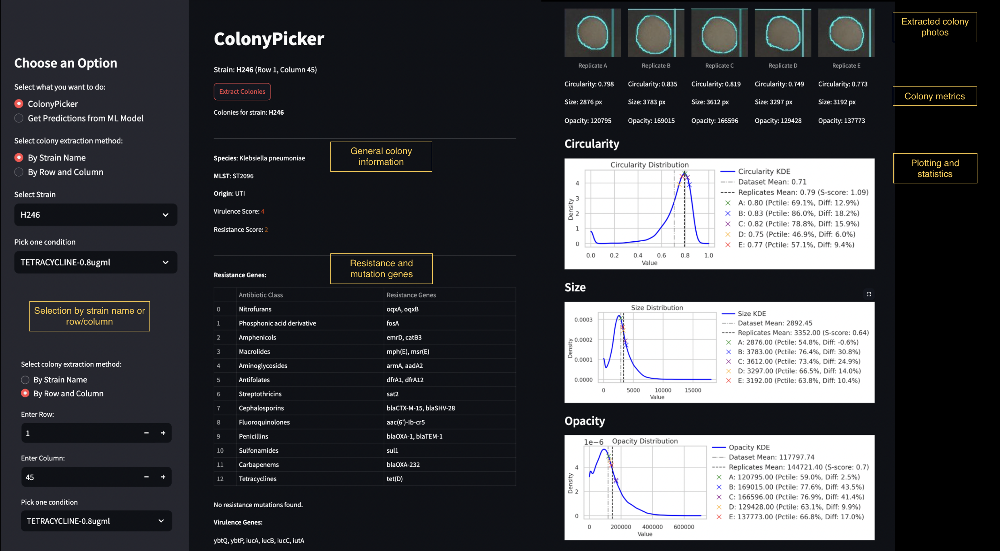
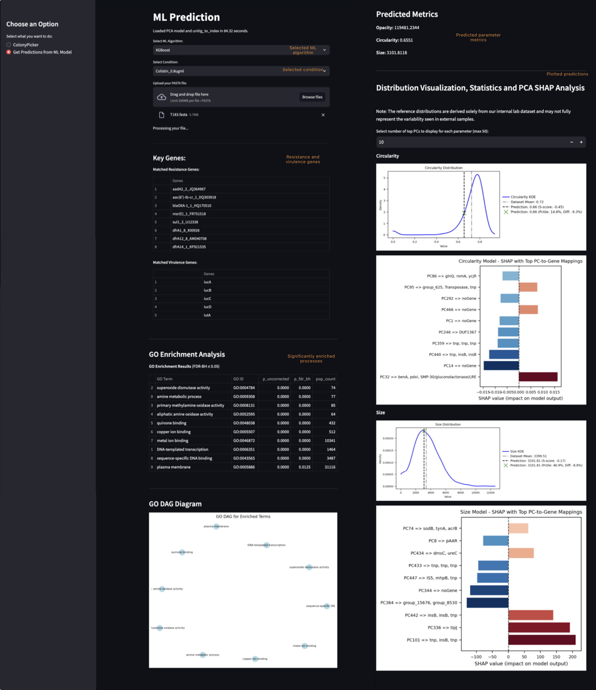

# ChemGenomicsKp Application

## Overview

**ChemGenomicsKp is a **Streamlit-based application** for analyzing bacterial colonies. It provides both **colony picking** and **machine learning-based predictions** (from FASTA files) in a single, user-friendly interface.**
---
## Background & Purpose

_Klebsiella pneumoniae_ is a bacterium of global medical importance, known for causing pneumonia, urinary tract infections, and bloodstream infections—particularly in healthcare settings.

To effectively track and combat infections, it's crucial to understand both the observable behaviors of bacterial colonies and the genetic factors driving these behaviors. By combining direct observations of colony morphology (Size, Circularity, and Opacity). Colony morphology can reflect a strain’s ability to withstand antibiotics, produce biofilms, or express certain virulence factors. 

with genomic analysis, researchers can form a more complete picture of how strains respond to antibiotics and other stressors.  

This app not only streamlines high-throughput screening but also bridges the gap between what we see in the lab and what lies within the genetic code.

## The App Features:

- **Colony Picker:**  
  Colony Picker extracts images of bacterial colonies grown on agar plates and visualizes individual colonies and displays the measurements of key morphological features—such as size, circularity, and opacity—that serve as indicators of a strain’s behavior and its response to growth conditions and/or antibiotic treatments. 

   - **Extract and analyze** colonies based on strain names or grid positions.
   - **Calculate colony metrics**: opacity, circularity, and size.
   - **Visualize results** directly in the application.

- **ML Prediction (Genomic Data Analysis):**  
  Genomic Data Analysis analyzes genomic sequences from FASTA files to detect resistance and virulence genes and predict colony characteristics using machine learning models (XGBoost and TabNet). FASTA files are plain text files that store the DNA sequences of bacterial strains. The application processes these sequences to detect resistance and virulence genes. Lastly, this genomic information is used to predict colony characteristics—linking the genetic makeup (=genotype) of the bacteria with observable traits (=phenotype) such as colony size, shape, and opacity.
  
  By linking genotype and phenotype, this app identifies specific genes that correlate with observable morphological traits, providing an insights into the genetic drivers of antimicrobial resistance. The predictive modeling component enables rapid assessment of strain responses to antibiotics.

   - **Upload FASTA files** to predict colony traits (opacity, circularity, size) with **pre-trained XGBoost and TabNet models**.
   - **PCA & SHAP Analysis**: visualize principal components and SHAP values for deeper model interpretability.
---

## File structure

```plaintext
ChemGenomicsKp/
├── app/
│   ├── __init__.py
│   ├── main.py
│   ├── colony_picker.py
│   ├── ml_prediction.py
│   └── ...
├── utils/
│   ├── __init__.py
│   ├── data_loading.py
│   ├── image_handling.py
│   ├── ml_models.py
│   └── gbff_processing.py
├── config/
│   └── config.yaml
├── data/
│   ├── resistance_genes_seq.fsa
│   ├── virulence_genes_seq.fas
│   ├── reference.gbk.gb
│   └── ...
├── models/
│   ├── pca_500_fitted_model_xg.joblib  # To be downloaded from link in "Install Dependencies" section
│   ├── unitig_to_index_xg.pkl  # To be downloaded from link in "Install Dependencies" section
│   └── ...
├── newfigs/
├── iris_measurements/  # IRIS measurement files
├── requirements.txt
├── README.md
└── .gitignore
```
---

## The App

When the application launches, a sidebar will appear that shows two options **ColonyPicker** and **Get Predictions from ML Model**. Below is an overview of the initial options, extraction methods, ML predictions, and the resulting outputs.

---

### Initial Options

1. **Select what you want to do**  
   - **ColonyPicker**  
     - Analyze colonies using plate images (32×48 grids) located in the `data/plate_images` folder.  
     - Each condition (e.g., specific antibiotic concentration, growth medium, or stress) has **5 replicate images**.  
     - Optionally filter colonies by **strain name** or **grid coordinates** to focus on particular isolates or locations.


---

## ColonyPicker -  Visualizing Existing Colonies

Regardless of the chosen mode, the following methods are available for pinpointing colonies:

- **By Strain Name**  
  - Choose a specific bacterial strain from a dropdown.  
  - Narrow the search further by specifying conditions (e.g., treatments or growth environments).

- **By Row and Column**  
  - Provide the exact plate coordinates (row, column).  
  - Useful if you already know where the colony of interest lies on the plate.

### Colony Metrics

For every colony extracted, the tool outputs:
- **Images**: 5 replicate images for the selected condition and colony location.  

- **Circularity**: How close the colony is to a perfect circle (0-1).  
- **Size**: The area occupied by the colony in pixels.  
- **Opacity**: Intensity or “darkness” of the colony, indicating density or transparency levels.

All metrics are plotted for each of the **5 replicates** (one plot per condition) and then aggregated to show **overall trends**. Specifically, the application calculates:

- **Mean**: Average value of the metric across replicates.  
- **S-score**: A z-score–based metric indicating how far a replicate’s mean deviates from the dataset’s overall mean, adjusted by standard deviation and number of replicates.  
- **Percentile**: The position of each colony’s metric within the broader dataset distribution (e.g., 90th percentile).  
- **% Difference from Mean**: How much each value differs from the global mean (as a percentage).

- **Plots of Colony Metrics**: Visualize circularity, size, and opacity across replicates, with options to compare against larger datasets or reference distributions.

- **Resistance Genes and Mutations & Virulence Genes**: A list of detected genetic elements relevant to antimicrobial resistance and virulence.  




----

## ML-Based Predictions

In addition to colony image analysis, the application offers **machine learning predictions** to estimate key colony traits—**opacity**, **circularity**, and **size**—directly from genomic. This feature is especially useful for users who want to predict how a bacterial strain (represented by a FASTA file) might behave under a given experimental condition. Below is an overview of how the ML module works:

1. **Condition Selection**  
   - Pick from a dropdown of available conditions (e.g., `Colistin_0.8ugml`), each associated with **pre-trained XGBoost models** specialized for that growth environment or antibiotic concentration.

2. **Upload FASTA**  
   - Begin by uploading a FASTA file containing the genomic sequences of your bacterial strain.  
   
3. **Convert to Unitigs**  
   - All **31-mers** are extracted from the uploaded sequence.  
   - These k-mers form a **presence/absence vector**, reflecting which genes are present or absent in the uploaded FASTA file.

4. **Generate Predictions**  
   - **XGBoost models** use the PCA-transformed features to predict:  
     - **Opacity**  
     - **Circularity** 
     - **Size**   
   - The results appear **immediately** in the interface.

5. **View Stats & Plots**  
   - The application compares your predicted values to a broader dataset:
     - **Mean** of the dataset  
     - **S-score** 
     - **Percentile** 
     - **% Difference**  
   - **Distribution plots** illustrate how your predictions fit within the population.

6. **PCA & SHAP Interpretation**  
   - **SHAP values** highlight which PCA components most influence each prediction.  
   - Users can view the **top unitigs** driving these components, and map them back to corresponding **genes** via a reference GenBank file.  
   - This reveals **genomic regions** that are especially significant for each trait.

7. **Resistance & Virulence Genes**  
   - The application  checks for known **resistance** and **virulence** genes by comparing against local reference databases.


Overall, the ML-based prediction module connects **genomic information** to **phenotypic traits** , making it easy to hypothesize how certain genetic features might affect colony characyeristics under specific growth conditions.




---

## How to run the app

### Installation

### Clone the Repository
```bash
git clone https://github.com/notnat9/amr_genomics_kp.git
cd ChemGenomicsKp
```

### Set Up Virtual Environment
```bash
# Windows
python3 -m venv venv
venv\Scripts\activate

# Unix/MacOS
python3 -m venv venv
source venv/bin/activate
```

### Install Dependencies
```bash
pip install -r requirements.txt
```

2. Download and place these files in `models/` directory:
   - [pca_500_fitted_model_xg.joblib](https://mega.nz/file/YHdF1Z4J#ejON7zilFjXF2xR9po-8OWuvmMbomJ-BJBdHaxrplMM)
   - [unitig_to_index_xg.pkl](https://mega.nz/file/AGNi1ILZ#lkPcN6Gb0Yo3ndXlxvMQTpzIUfsu5E1SwOLGyL-k1Yc)


 Model File Information


The PCA model dimensions directly impact file size:

```
Model Dimensions:
- n_components = 500 
- n_features = around 2,500,000 

Size Calculation:
500 components × 2.5M features = 1.25B values -> need for a large file
```
->  GitHub file size limit: 100 MB

---
### Configuration
Update `config/config.yaml` with correct paths

## Addition of more trained models
Possible by creating a new sub-folder in the ML Algorithm folder (e.g. Models/XGBoost/new trained condition)

## Usage


### Web Application
Run the Streamlit app:
```bash
cd path/to/amr_genomics_kp
```
```bash
streamlit run app/main.py
```
The application will open in your default browser at `http://localhost:8501`

### Command Line Interface (CLI)

#### Colony Picker
**Using row/column coordinates:**
```bash
python cli/amr_genomics_cli.py colony_picker \
    --config config/config.yaml \
    --row 31 \
    --col 48 \
    --condition "Colistin-0.8ugml"
```

**Using strain names (reference strain_names.txt):**
```bash
python cli/amr_genomics_cli.py colony_picker \
    --config config/config.yaml \
    --strain H150 \
    --condition "Colistin-0.8ugml"
```

#### ML Prediction
```bash
python cli/amr_genomics_cli.py ml_prediction \
    --config config/config.yaml \
    --fasta path/to/your/30.fasta \
    --condition "Colistin_0.8ugml"
```

### Important Notes
1. Valid conditions are listed in `condition_names.txt`
2. Strain names must match exactly those in `strain_names.txt`
3. Condition names are case-sensitive and must match exactly
4. Replace `path/to/your/30.fasta` with your actual FASTA file path

----

## Docker Installation (Recommended)

### Prerequisites
- Install Docker Desktop:
  - [Windows & macOS Download](https://www.docker.com/products/docker-desktop)
  - [Linux Installation Guide](https://docs.docker.com/engine/install/)

### Run with Docker
1. Pull the pre-built image:
```bash
docker pull hinkovn/my_streamlit_app_v5:test
```

2. Start the container:
```bash
docker run -p 8501:8501 --name chemgenomics-app hinkovn/my_streamlit_app_v5:test
```

3. Access the application:
```bash
http://localhost:8501
```

### Docker Desktop GUI Instructions
1. **Pull Image:**
   - Open Docker Desktop
   - Go to Images > Pull
   - Enter `hinkovn/my_streamlit_app_v5:test`

2. **Run Container:**
   - Find the image in your Images list
   - Click "Run"
   - Set:
     - Port: `8501:8501`
     - Name: (optional) e.g., `chemgenomics-app`

3. **Manage Containers:**
   - Stop: Click ●■ icon in Containers tab
   - Remove: Click 🗑️ icon after stopping

### Advantages
- No manual model file downloads
- Pre-configured environment
- Consistent behavior across OS
- Single-command updates
- Isolated from system packages


### Maintenance
```bash
# Update to latest version
docker pull hinkovn/my_streamlit_app_v5:test

# Remove old containers
docker rm chemgenomics-app

# View logs
docker logs chemgenomics-app
```